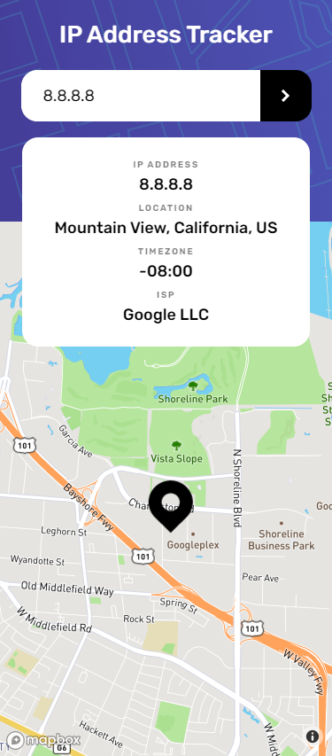

## Getting Started

First, run the development server:

```bash
yarn install
# or
yarn dev
```

Open [http://localhost:3000](http://localhost:3000) with your browser to see the result.

## API
- Geo Ipify API [API Link](https://geo.ipify.org/)

## Map Component
- React Graph GL [Github Link](https://github.com/visgl/react-map-gl#readme)

## Desktop Screenshot


## Mobile Screenshot


